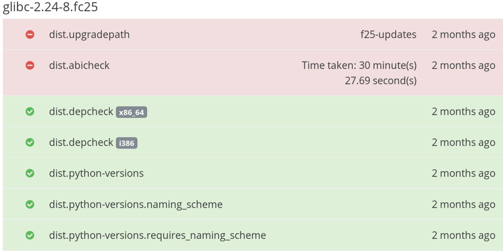

:title: Greenwave | By Matt Jia
:data-transition-duration: 1500
:css: greenwave.css

----

:id: step1

Gating on automated tests in Fedora - Greenwave
===============================================

Factory 2.0

Matt Jia <mjia@redhat.com>

----

Automated test results in Bodhi
===============================

----

:id: greenwave

Greenwave is:
===============

* a service for making decisions
* about artifacts
* at certain gating points
* based on test results in ResultsDB
* according to some policies

----

:id: problem1

Problem #1
==========

No checks are required for all the distributions.

----

:data-y: r1000
:id: checks

What checks do we want to enforce?
==================================

* dist.abicheck
* dist.rpmdeplint
* dist.upgradepath

----

:data-x: r-800
:data-scale: 1

Problem #2
==========

Specifying required checks is a repetitive manual process

----

Why a new service?
==================

----

:id: badtest

What happens when a test goes bad?
==================================

----

:data-x: r-500
:data-scale: 1

:id: waiverdb

WaiverDB is:
============

* a microservice for storing waivers against test results in ResultsDB
* generalizing the existing waiving functionalities

----

.. image:: images/workflow.png
    :height: 600px
    :width: 800px

----

:id: freshmaker

Help Freshmaker enforce quality
===============================

Gating on the *rebuilds*

----

:id: underhood

How Greenwave works under the hood
==================================

.. note::

  So the next topic is I would like talk about how Greenwave works under the hood
  and where are we at today with the current implementation. All of these three
  services are implemented by using Flask which is a microframework for Python.
  It is well documented and easy to code.

----

:id: policyexample

An example of a Greenwave policy
================================

.. code:: YAML

  --- !Policy
  id: 1
  product_version:
    - fedora-26
  decision_context:
    - bodhi_update_push_stable
  rules:
    - !PassingTestCaseRule {test_case_name: dist.abicheck}
    - !PassingTestCaseRule {test_case_name: dist.deplint}
    - !PassingTestCaseRule {test_case_name: dist.upgradepath}

----

:id: gapiexample

An example of calling Greenwave API
===================================

.. code::

    $ http POST http://greenwave.stg.fedoraproject.org/api/v1.0/decision \
          decision_context=bodhi_update_push_stable \
          product_version=fedora-26 \
          subject:='[{"item":"glibc-1.0-1.f26", "type": "koji_build"}]'

.. code:: JSON

    {
        "applicable_policies": [1],
        "policies_satisified": false,
        "summary": "1 of 3 required tests failed",
        "unsatisfied_requirements": [
            {
                "item": {
                    "item": "glibc-1.0-1.f26",
                    "type": "koji_build"
                },
                "testcase": "dist.abicheck",
                "type": "test-result-failed"
            }
        ]
    }

----

:id: wapiexample

An example of calling WaiverDB API
==================================

.. code::

    $ http --auth-type=negotiate --auth : POST \
         http://waiverdb.stg.fedoraproject.org/api/v1.0/waivers/ \
         result_id=1 \
         product_version=fedora-26 \
         waived=true \
         comment="Because I say it!"

.. code:: JSON

    {
        "comment": "Because I say it!",
        "id": 1,
        "product_version": "fedora-26",
        "result_id": 1,
        "timestamp": "2017-08-16T22:21:29.926900",
        "username": "mjia",
        "waived": true
    }

----

:id: nextsteps

Next steps
==========

* Bodhi integration
* Message bus driven
* Per package policy

----

:data-rotate: 120
:id: examples

*Questions?*
============

* https://pagure.io/greenwave

* https://pagure.io/waiverdb
